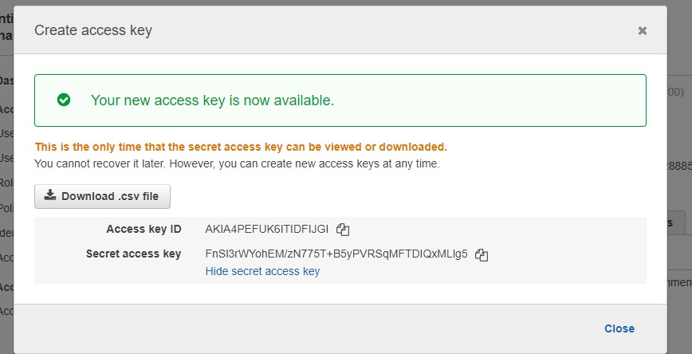
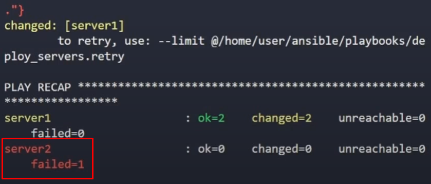
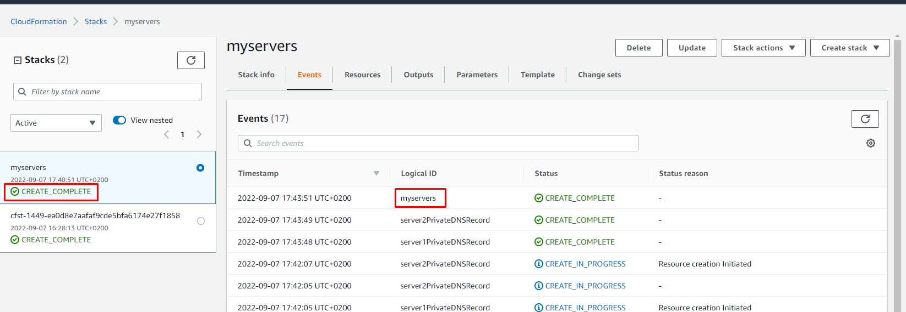
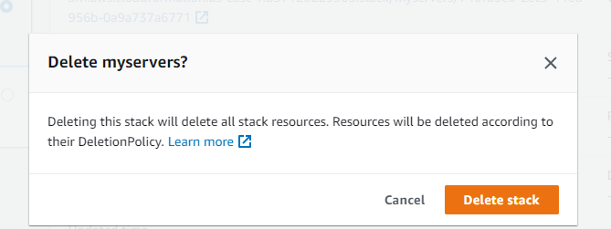

# Desplegar infra con Cloudformation a través de Ansible.

En esta práctica usaremos el laboratorio de práctica que nos ofrece la plataforma de A cloud Guru para inicializar una sesión de AWS.

Usaremos el WSL de nuestro PC o una máquina virtual Linux para instalar unas herramientas de cara a poder clonar repositorios de git, poder interactuar con el AWS desde CLI con python-boto3 y lanzar playbooks con Ansible.


## Proceso
***
### 1. Levantar y configurar el entorno para actuar sobre nuestro playground de testeo

Si nuestro playground no nos ofrece ya la access y secret key desde que nos ofrece el link a la consola podemos generar un nuevo par de claves siguiendo el siguiente proceso:

1.1. Iniciamos sesión en la consola y generamos un par de claves nuevos:



1.2. (Siendo root) Desde la línea de comandos de nuestra WSL o VM linux ejecutamos los siguientes comandos:

```bash
#!/bin/bash
#Change to root dir
cd

#backup .aws if exists to prevent unnecesary changes
mv .aws .aws.ori

#create and change to .aws dir
mkdir .aws
cd .aws

#create config & credentials files to work with AWS
cat <<EOF>> config
[default]
region=us-east-1
output=json
EOF

cat <<EOF>> credentials
[default]
aws_access_key_id=$AWS_ACCESS_KEY_ID
aws_secret_access_key=$AWS_SECRET_ACCESS_KEY
EOF

```

1.3. (Siendo root) Exportamos las claves generadas en el paso 1.1 mediante los comandos:

```bash
export AWS_ACCESS_KEY_ID=<INTRODUCE_AQUI_TU_ACCESS-KEY>

export AWS_SECRET_ACCESS_KEY=<INTRODUCE_AQUI_TU_SECRET-KEY>
```

1.4. (Siendo root) Instalar las herramientas necesarias para llevar a cabo la práctica:

```bash
sudo apt update

sudo apt-get install ansible #instalamos ansible
sudo apt-get install git #instalamos git para clonar repo
sudo apt install python3-pip #instalamos python3 para descargar boto3 y usar awscli
python3 -m pip install boto3
pip3 install --upgrade awscli #sin esto no podremos lanzar comandos de aws cli
```

1.5 Clonamos el proyecto en una carpeta específica:

```bash
cd /home/$USER
mkdir git_projects
cd git_projects

#Clonamos el repo con el playbook de ansible, archivos de variables y template de CloudFormation:
git clone https://github.com/Josh-Tracy/Ansible
```

---

### 2. Crear una keypair para el acceso a las instancias EC2 creadas y guardarla en lugar local

```bash
aws ec2 create-key-pair --key-name <your_key_name> --query 'KeyMaterial' --output text > <your_key_name>.pem
```

donde  reemplazaremos <your_key_name> por el nombre que queramos darle a nuestra clave como por ejemplo:

```bash
aws ec2 create-key-pair --key-name keypair --query 'KeyMaterial' --output text > keypair.pem
```

---

### 3. Modificar los archivos para adaptarlos a los identificadores de nuestra infra.

En este ejemplo vamos a usar la ID de la VPC que ya viene por default en la región de N. Virginia (us-east-1).

Modificaremos el fichero recién clonado ```/Ansible/inventory/group_vars/servers_vars.yml```
y sustituiremos los siguientes parámetros por aquellos que se adapten a nuestra infra en AWS:

- `aws_key_name`  --> "keypair"
- `subnet`        --> El ID de la subnet "us-east-1a"
- `subnet2`       --> El ID de la subnet "us-east-1b"
- `ebs_key`       --> Key Management service > AWS managed keys > aws/ebs Key ID
- `private_hosted_zone` --> Route 53 > Hosted Zones > Create hosted zone "ansiblelab.com"
- `vpc_id`        --> VPC ID de la default VPC en la región de us-east-1

---

### 4. Lanzar el playbook y ver resultados desde la consola

Situados en la carpeta `/Ansible` clonada anteriormente ejecutaremos el comando:

```bash
ansible-playbook -i hosts playbooks/deploy_servers.yml
```

y esperar unos resultados como estos:


No importa que aparezca en rojo ya que comprobandolo en CloudFormation y en la consola los recursos se habrán creado (Pendiente de ver por qué pasa esto):



Y ya estaría!!!!!!

:D

Si por algun casual queremos eliminar todo lo lanzado mediante el playbook solo necesitaremos eliminar el stack



---
### Información de interés para expandir el conocimiento

[LINK](https://docs.aws.amazon.com/es_es/IAM/latest/UserGuide/id_credentials_access-keys.html) a la guía de la documentación oficial.

Lo primero que haremos será generar credenciales desde la consola de AWS o desde la CLI.

>Para administrar las claves de acceso >de un usuario de IAM con la AWS CLI, >ejecute los siguientes comandos.
>- Para crear una clave de acceso: 
```aws iam create-access-key```
>- Para deshabilitar o volver a activar una clave de acceso: ```aws iam update-access-key```
>- Para generar una lista de las claves de acceso de un usuario: ```aws iam list-access-keys```
>- Para determinar cuándo se utilizó por última vez una clave de acceso: ```aws iam get-access-key-last-used```
>- Para eliminar una clave de acceso: ```aws iam delete-access-key --access-key-id <acces_key_id>```
